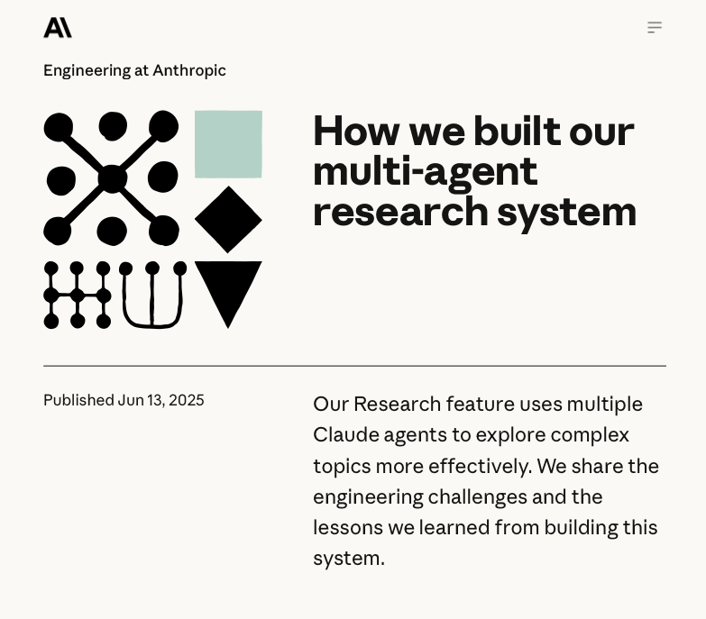

# How Anthropic Built a Multi-Agent Research System (Conceptual Overview)


## Learning objective
By the end of this video, you will have the conceptual knowledge required to build your first simple multi-agent system with confidence and clarity.

*Note*: **This will be using the same method that anthropic used to build their own researcher agent!**




## Outline
### Introduction

> We’ll move from understanding a single LLM → an agent → Anthropic’s multi-agent researcher → and finally why this architecture exists at all.

The second video will cover the actual implementation of the system in `python`.


- **After watching this video, you should be able to answer**:
    - What is an agent?
    - What is anthropic's multi-agent researcher and how does it work?
    - Why use multi-agent systems?
- **Who this video is for**:
    - Beginner programmers
    - AI enthusiasts
    - Intermediate programmers who want to learn how the fundamental concepts of building multi-agent systems.

- **What this video does not cover**:
    - Implementing a multi-agent system in python (this is covered in Part 2: [How Anthropic Built a Multi-Agent Research System (Implementation)](https://www.youtube.com/watch?v=BronsonHill))

    - Implementing an integrated multi-agent system into a chatbot (this is covered in Part 3: [How Anthropic Built a Multi-Agent Research System (Advanced Implementation)](https://www.youtube.com/watch?v=BronsonHill))

    - Implementing a UI for a multi-agent system (this is covered in Part 4: [How Anthropic Built a Multi-Agent Research System (UI Implementation)](https://www.youtube.com/watch?v=BronsonHill))

    - Evaluating multi-agent systems
    - Designing multi-agent systems in production software
    - Deploying multi-agent systems in production software

### Prerequisites
- Have used an LLM before (chatgpt, claude, etc.)

### Resources
- Anthropic's engineering blog post: [How we built our multi-agent research system](https://www.anthropic.com/engineering/multi-agent-research-system)
- Repository: [anthropic-multi-agent-system](https://github.com/bronsonhill/anthropic-multi-agent-system)

## Key Concepts
### From LLMs to Agents
- Let's first take a quick look at a *Large Language Model* (LLM):
    ```mermaid
    graph LR
        %% Top horizontal flow
        In((Text In)) --> LLM[LLM]
        LLM --> Out((Text out))

        %% Theming to match provided image
        style In fill:#fff7f3,stroke:#ff8c00,color:#ff8c00
        style Out fill:#fff7f3,stroke:#ff8c00,color:#ff8c00
        style LLM fill:#ffebee,stroke:#ef5350,color:#c62828
    ```
    - At its core, an LLM transforms input text into an output - a response.
    - Think ChatGPT, Claude, Grok, or Gemini.
- Now, let's look at an *Agent*:
    ```mermaid
    graph LR
        %% Top horizontal flow
        In((In)) --> Agent[LLM Agent]
        

        %% Bottom augmentations
        Agent <-. "Follows" .-> System-Prompt[System Prompt]
        Agent <-. "Uses" .-> Reasoning[Reasoning]
        Agent <-. "Uses" .-> Tools[Tools]
        Agent <-. "Read/Write" .-> Memory[Memory]

        Agent --> Out((Out/Outcome))

        %% Theming to match provided image
        style In fill:#fff7f3,stroke:#ff8c00,color:#ff8c00
        style Out fill:#fff7f3,stroke:#ff8c00,color:#ff8c00
        style Agent fill:#f7fff7,stroke:#4caf50,color:#4caf50,stroke-width:2px
        style Reasoning fill:#f3f0ff,stroke:#9575cd,color:#5e35b1
        style Tools fill:#f3f0ff,stroke:#9575cd,color:#5e35b1
        style Memory fill:#f3f0ff,stroke:#9575cd,color:#5e35b1
        style System-Prompt fill:#f3f0ff,stroke:#9575cd,color:#5e35b1
    ```
    - An *Agent* is an *LLM* empowered with features that allow it to complete tasks. The most basic features include:
        - **System Prompt**: Text that instructs the agent on how to behave.

            > You are a socratic tutor for a student who is learning about memetics. Your job is to guide the student through the process of learning about memetics, and help them understand the concepts of memetics...

        - **Reasoning**: The agent's ability to use tokens between input and output to reason about its actions. It is a behaviour that emerges when an LLM is run iteratively in a loop.
            ```mermaid
            graph LR
                P((Plan)) -- Reasoning --> A((Act)) -- Reasoning --> O((Observe)) -- Reasoning --> R((Revise)) -- Reasoning --> P
                style P fill:#fff3e0,stroke:#ff9800,color:#e65100
                style A fill:#fff3e0,stroke:#ff9800,color:#e65100
                style O fill:#fff3e0,stroke:#ff9800,color:#e65100
                style R fill:#fff3e0,stroke:#ff9800,color:#e65100
            ```
        - **Tools**: The agent's ability to use given tools. For example, search the web or write files.
        - **Memory**: Mechanisms that allow the agent's context window to be managed deliberately (ie. from external sources, such as a database, other agents, previous conversations or user information).


### What is anthropic's multi-agent researcher?
- Anthropic's multi-agent researcher is a system of agents that work together to complete thorough research.
    ```mermaid
    graph TD
        
        direction TB
        
        %% Top Layer
        Lead["Lead agent (orchestrator)"]

        %% Bottom Layer
        S1["Search subagent"]
        S2["Search subagent"]
        S3["Search subagent"]
        Citations["Citations subagent"]
        MemoryNode["Memory"]

        %% Vertical Connections
        Lead <--> S1
        Lead <--> S2
        Lead <--> S3
        Lead --> Citations
        Lead <--> MemoryNode


        %% Theming to match provided image
        style Lead fill:#cadff2,stroke:#90caf9,color:#546e7a,stroke-width:2px
        style Citations fill:#f7fff7,stroke:#4caf50,color:#4caf50
        style MemoryNode fill:#cadff2,stroke:#90caf9,color:#546e7a
        style S1 fill:#f7fff7,stroke:#4caf50,color:#4caf50
        style S2 fill:#f7fff7,stroke:#4caf50,color:#4caf50
        style S3 fill:#f7fff7,stroke:#4caf50,color:#4caf50
    ```
- The system is comprised of:
    - **A lead agent (orchestrator)**, which is able to spawn multiple subagents to complete the research task.
    - **Search subagents**, which are able to search the web for information.
    - **Citation subagent**, which inserts citations into the research.
    - A memory node, which stores the research.
    ```mermaid
    sequenceDiagram
        participant U as User
        participant L as Lead Agent (Orchestrator)
        participant S as Search Subagents
        participant C as Citation Subagent
        participant M as Memory (Shared State)

        U->>L: Research Request
        Note over L: Decompose Task
        
        L->>S: Delegate Searches
        S->>S: Search Web
        S->>M: Write Findings
        S-->>L: Search Completion
        
        L->>M: Aggregate Final Result
        M-->>L: Draft Research Report
        
        L->>C: Delegate Citations
        Note over C: Verify Sources & Add Citations
        C-->>L: Final Research with Citations
        
        L-->>U: Deliver Research Report
    ```

### Why multi-agent systems?
- First, let's consider the question why *agents*?
    - Agents overcome the limitations of LLMs, which are:
        - **Confined system**: as we saw earlier, they are limited to raw text. LLMs cannot work with non-textual data or external systems.
        - **Limited context window**: it is limited by *how much* text it can produce and process at once.
    ```mermaid
    graph TD
        subgraph Standalone_LLM [Standalone LLM]
            direction TB
            
            subgraph Confined [Confined System]
                direction LR
                In((Text Input)) -- "Limited length" --> LLM[LLM]
                LLM -- "Limited length" --> Out((Text Output))
            end
        end

        %% External Systems (Blocked)
        Internet((Internet))
        FileSystem((File System))
        APIs((External Apps))

        Internet -- "X" --- Confined
        FileSystem -- "X" --- Confined
        APIs -- "X" --- Confined

        %% Styling


        style LLM fill:#ffebee,stroke:#ef5350,color:#c62828
        style In fill:#fff7f3,stroke:#ff8c00,color:#ff8c00
        style Out fill:#fff7f3,stroke:#ff8c00,color:#ff8c00
        
        style Internet fill:#f5f5f5,stroke:#9e9e9e,color:#9e9e9e
        style FileSystem fill:#f5f5f5,stroke:#9e9e9e,color:#9e9e9e
        style APIs fill:#f5f5f5,stroke:#9e9e9e,color:#9e9e9e
    ```

    - Agents overcome these:
        - With *tools*, agents are able to work with *non-textual* data and *external systems* (such as apps, files or APIs).
            ```mermaid
            graph LR
                Agent[Agent] <--> Tools[Tools]
                Tools <--> Calendar((Calendar App))
                Tools <--> Browser((Browser))
                Tools <--> Files((Files))
                
                style Agent fill:#f7fff7,stroke:#4caf50,color:#4caf50
                style Tools fill:#f3f0ff,stroke:#9575cd,color:#5e35b1
                style Calendar fill:#f5f5f5,stroke:#9e9e9e,color:#9e9e9e
                style Browser fill:#f5f5f5,stroke:#9e9e9e,color:#9e9e9e
                style Files fill:#f5f5f5,stroke:#9e9e9e,color:#9e9e9e
            ```

        - With *memory*, an agent's *context* can be managed across multiple actions.
            ```mermaid
            graph LR
                Action1[Action 1] <--> Mem[(Memory)] <--> Action2[Action 2]
                style Mem fill:#f3f0ff,stroke:#9575cd,color:#5e35b1
            ```

        - With *reasoning* loops, the model can plan, act, observe, and revise.

    - Now, let's consider the limitations of *agents*:
        - **Task length**:
            - For a complex task, many steps may be required, like plan, search, reason, evaluate, and synthesise. Such tasks may exceed the *context window* of the agent, even with *memory*.
        - **Role confusion**:
            - For a complex task, the agent would be instructed to do many different tasks. This may lead to role confusion, where the agent may not know which task to focus on.
        - **Sequential execution**:
            - Agents only execute actions in sequence. This can be slow, and contributes to both the *task length* and *role confusion* limitations.
            ```mermaid
            graph TD
                T1[Task 1] --> T2[Task 2] --> T3[Task 3] --> T4[Task 4] --> TN[...]
                
                TN -.-> C1{{Context Full}}
                TN -.-> C2{{Role Confusion}}
                TN -.-> C3{{Slow & Sequential}}

                style C1 fill:#ffebee,stroke:#ef5350,color:#c62828
                style C2 fill:#ffebee,stroke:#ef5350,color:#c62828
                style C3 fill:#ffebee,stroke:#ef5350,color:#c62828
            ```
            > In short, a single agent becomes a cognitive bottleneck when task complexity exceeds what one reasoning loop can reliably manage.
    - Multi-agent systems overcome these limitations by breaking down complex tasks into smaller, more manageable subtasks.
        ```mermaid
        graph TD
            Task[Complex Multi-Step Task] --> Lead[Lead Agent / Orchestrator]
            
            subgraph Parallel_Specialization [Solving for Complexity & Scale]
                direction TB
                Lead --> Sub1[Specialist Agent A]
                Lead --> Sub2[Specialist Agent B]
                Lead --> Sub3[Specialist Agent C]
                
                Sub1 -- "Clear Focus" --> Res1[Result 1]
                Sub2 -- "Clear Focus" --> Res2[Result 2]
                Sub3 -- "Clear Focus" --> Res3[Result 3]
            end
            
            Res1 --> Agg[Synthesized Result]
            Res2 --> Agg
            Res3 --> Agg


            %% Styling
            style Lead fill:#cadff2,stroke:#90caf9,color:#546e7a,stroke-width:2px
            style Sub1 fill:#f7fff7,stroke:#4caf50,color:#4caf50
            style Sub2 fill:#f7fff7,stroke:#4caf50,color:#4caf50
            style Sub3 fill:#f7fff7,stroke:#4caf50,color:#4caf50
        ```
        - These gains come with tradeoffs. Anthropic reported:
            - That compared to a single agent, their multi-agent research system was up to **90% faster** (due to parallelization), and **90% more effective** (due to subagent specialization).

            - That "*agents typically use about 4× more tokens than chat interactions, and multi-agent systems use about 15× more tokens than chats.*"
            - Methods for prompt engineering, evaluating performance and considering production.

        - *Note*: there are many benefits to multi-agent systems, but they also come with their own challenges. For example, they:
            1. Require more resources, 

            2. are more complex to design and implement, and
            3. errors can multiply.

    

## Summary
> In this video, we built a conceptual model of agents and multi-agent systems. In the next video, we’ll take this exact architecture and implement it step by step in Python.

- Implementing a multi-agent system in python (this is covered in Part 2: [How Anthropic Built a Multi-Agent Research System (Implementation)](https://www.youtube.com/watch?v=BronsonHill))

